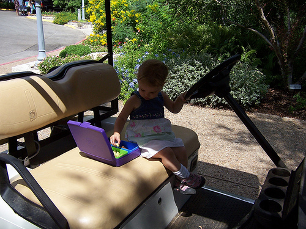
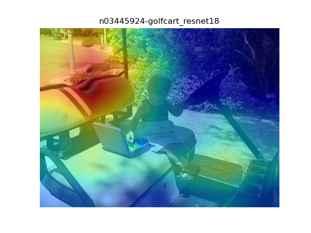
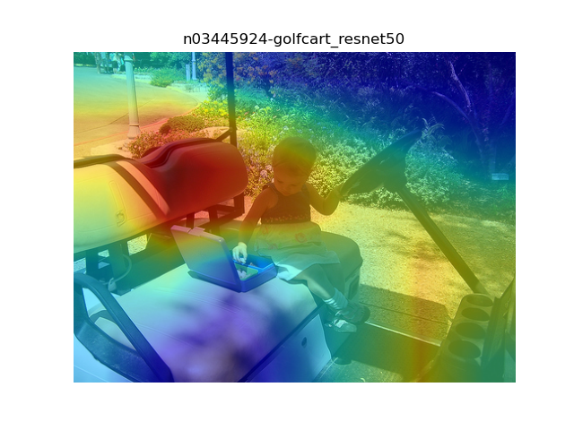
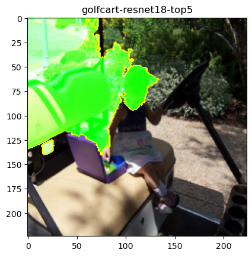
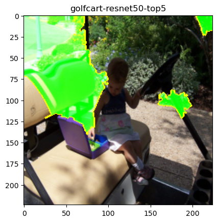
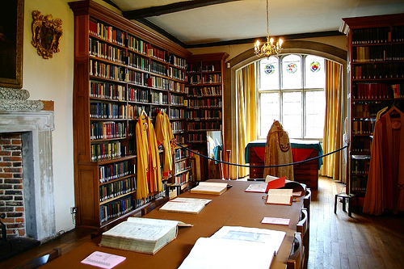
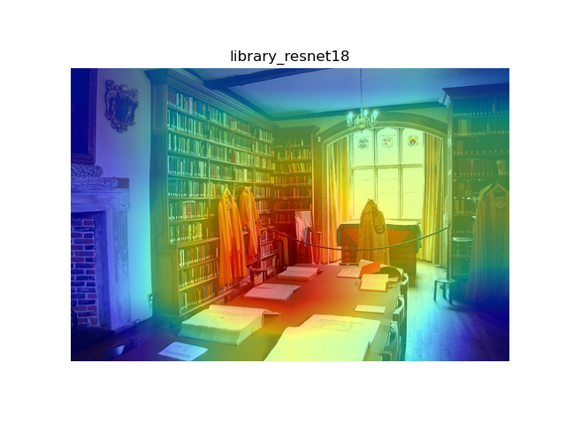
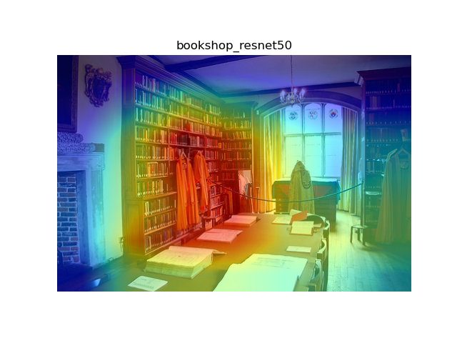
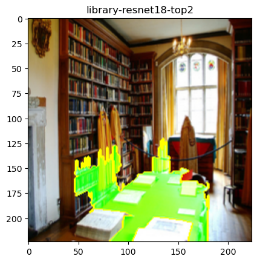
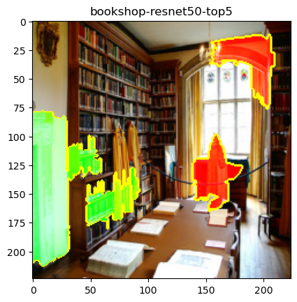

# Explanations for Resnet18 and Resnet50 using Grad-CAM and LIME methods

> Tree 2023.11.29


## Introduction

This project delves into the interpretability of Convolutional Neural Network (CNN) models through the examination of classification results for 10 test images. The primary objective is to unravel the decision-making processes of two pre-trained CNN models, Resnet18 and Resnet50. To achieve this, two interpretability methods, Grad-CAM and LIME, are employed.

Grad-CAM allows for the generation of heatmaps that highlight the regions of an image contributing most to the model's prediction. Simultaneously, the Local Interpretable Model-agnostic Explanations (LIME) method, provides insights into model predictions by perturbing input data and observing the resulting changes in predictions.

Through the juxtaposition of these interpretability methods, this project aims to offer a nuanced understanding of the decision boundaries and prediction behaviors of the chosen CNN models. The ensuing report will comprehensively present predictive scores, visualization through heatmaps, and discussions on the results, fostering a deeper insight into the interpretability of complex neural network models.

## Implementation

### Preprocessing

Apply a different transform compared to the baseline in Tutorial 10.

It performs better with Resnet model on the test data.

```python
def get_pil_transform(): 
    transf = torchvision.transforms.Compose([
        torchvision.transforms.Resize((256, 256)),
        torchvision.transforms.CenterCrop(224)
    ])    

    return transf

def get_preprocess_transform():
    normalize = torchvision.transforms.Normalize(mean=[0.485, 0.456, 0.406],
                                    std=[0.229, 0.224, 0.225])     
    transf = torchvision.transforms.Compose([
        torchvision.transforms.ToTensor(),
        normalize
    ])    

    return transf    


# resize and take the center part of image to what our model expects
def get_input_transform():
    normalize = torchvision.transforms.Normalize(mean=[0.485, 0.456, 0.406],
                                    std=[0.229, 0.224, 0.225])       
    transf = torchvision.transforms.Compose([
        torchvision.transforms.Resize((256, 256)),
        torchvision.transforms.CenterCrop(224),
        torchvision.transforms.ToTensor(),
        normalize
    ])    

    return transf
```


### Grad-CAM

Grad-CAM (Gradient-weighted Class Activation Mapping) is a method for explaining the decisions of convolutional neural networks (CNN). Its purpose is to generate heatmaps to visualize the model's areas of interest on the input image, thereby helping to understand the model's prediction process.

Specifically, Grad-CAM is implemented through the following steps:

1. **Forward propagation:** Forward propagation of the input image through the trained convolutional neural network to obtain the final classification result.
2. **Calculate gradient:** Calculate the gradient of the target category relative to the output of the last convolutional layer. This gradient represents the degree of influence of the target category on the feature map of the last convolutional layer.
3. **Global average pooling:** Perform global average pooling on the gradient to obtain the weight on each feature map.
4. **Weight product:** Multiply the weight of each feature map with the corresponding convolutional layer output to obtain a weighted feature map.
5. **Sum:** Sum the weighted feature maps along the dimensions of the channel to obtain the final Grad-CAM heat map.

By visualizing Grad-CAM heatmaps, you can intuitively see which areas of the input image the model pays attention to when making classification decisions. This helps explain the model's decision-making process, especially providing valuable information when understanding why the model classified certain images in a specific way.


### LIME

LIME (Local Interpretable Model-agnostic Explanations) is a model-independent explanation method used to explain the prediction results of machine learning models. The goal of LIME is to explain the model's predictions by generating locally interpretable models in the input space.

Specifically, LIME is implemented through the following steps:

1. **Select instance:** Select a specific instance from the data set, that is, the input sample corresponding to the prediction result to be explained.
2. **Generate perturbed samples:** Perform random or purposeful perturbations on selected instances to generate a set of samples near the feature space.
3. **Get model predictions:** Use the original model to predict the generated disturbance samples and obtain the corresponding prediction probability or category.
4. **Fit the explanatory model:** Fit a simple and interpretable model (such as linear regression) on the perturbed samples and their corresponding model predictions to capture the model's behavior in the local area.
5. **Interpretation weight:** By interpreting the coefficients of the model, the relative importance of each feature to the local prediction of the model is obtained.
6. **Generate explanation:** Use the weights and eigenvalues of the explanation model to generate an explanation explaining which features in this local area play a key role in the prediction of the model.

In this way, LIME provides a local explanation of the model's decisions, i.e., a simplified model that explains the model's predictions within a specific region of the input space. This helps understand the behavior of the model on specific instances and provides a means of interpretability, especially for complex black-box models.


## Model

### ResNet18

Residual Network 18 (ResNet18) is a variant of the ResNet architecture, specifically designed for image classification tasks. Developed by Microsoft Research, ResNet18 is characterized by its 18-layer deep neural network structure. The innovation of ResNet lies in the introduction of residual learning, where shortcut connections, or skip connections, are used to skip one or more layers during training. This mitigates the vanishing gradient problem and facilitates the training of considerably deeper networks. ResNet18 has demonstrated remarkable performance in various computer vision tasks, owing to its ability to capture intricate features within images.

### ResNet50

ResNet50 is an extension of the ResNet architecture, featuring a deeper and more complex neural network with 50 layers. Like ResNet18, ResNet50 incorporates residual learning to address the challenges associated with training deep networks. With an increased depth, ResNet50 can model more intricate hierarchical features, making it particularly effective for demanding visual recognition tasks. ResNet50's architecture comprises multiple blocks with bottleneck structures, further enhancing its representational capacity. This model has proven to be highly successful in large-scale image classification challenges, achieving state-of-the-art results across various benchmarks. The increased depth in ResNet50 allows it to capture a broader range of features, making it well-suited for more complex and nuanced image recognition tasks.


## Cases

In this part, we will talk about several interesting images result.

Resnet18 performs worse than 50 in the most of time. But in few cases(e.g. Library), Resnet18 is better.

### Golfcart



#### Prediction

**resnet18**

| label         | probability |
| ------------- | ----------- |
| golfcart      | **77.65%**  |
| barrow        | 6.11%       |
| folding_chair | 3.10%       |
| motor_scooter | 1.73%       |
| park_bench    | 0.96%       |

**resnet50**

| label    | probability |
| -------- | ----------- |
| golfcart | **92.85%**  |
| swing    | 4.18%       |
| barrow   | 0.50%       |
| rifle    | 0.40%       |
| shovel   | 0.25%       |


#### Visualization

**Grad-CAM**





**Lime**





It is observed that the heat map generated using ResNet50 focuses on a smaller area than ResNet18, focusing on the back seat of the golf cart.

This may be due to the fact that ResNet50 has a deeper network structure than ResNet18 and can capture more complex and abstract features. Deeper networks may be more focused on identifying more subtle features and patterns, so the resulting Grad-CAM heat map may be more focused on specific areas on the back of a golf cart.

Upon employing the LIME interpretability method on both ResNet18 and ResNet50 pre-trained models, a noteworthy revelation emerged. In the image classification task, it became evident that ResNet50, in contrast to ResNet18, assigned less significance to human body parts in determining the final prediction. Specifically, the LIME interpretations highlighted that the presence or absence of human figures did not strongly influence ResNet50's decision-making process.

An intriguing insight unfolded during the analysis of an image depicting a scene with both a golf cart and a human. Contrary to expectations, ResNet50 seemed to prioritize features unrelated to the human presence. Instead, LIME emphasized the rear seat of the vehicle as a critical factor leading to the classification of the image as a golf cart. This starkly contrasts with ResNet18, which exhibited a comparatively higher reliance on human body parts for its predictions.

#### Discussion

This observation of Grad-CAM is not surprising because deeper networks are often able to capture higher-level features when processing images, which may be more relevant to important information for the model to make classification decisions. The purpose of Grad-CAM is to use gradient information to understand the important areas that the model focuses on when making decisions, and in the case of ResNet50, it may place more emphasis on specific features on the back seat of a golf cart.

Golf carts often have unique design features, and the back seats of most golf carts may be designed as bench seats that are joined together rather than as separate, independent seats. This design can accommodate multiple passengers, usually golfers and their clubs.

ResNet50 focuses more on the golf cart backseat when generating Grad-CAM, possibly because the model learned visual features associated with this specific design.


The disparity observed between ResNet18 and ResNet50 underscores the impact of model architecture on interpretability. The deeper and more complex nature of ResNet50 allows it to discern intricate features and patterns that ResNet18 might overlook. The devaluation of human body parts in favor of the vehicle's rear seat in ResNet50's decision-making process highlights the model's ability to capture nuanced contextual information.

This observation prompts contemplation on the importance of model interpretability in real-world applications. Understanding the factors influencing a model's predictions, especially in scenarios where human-centric features might be overshadowed, is crucial for building trust and ensuring robust performance. The dynamic nature of LIME in revealing these insights emphasizes its utility in unraveling the decision boundaries of complex neural networks and provides valuable cues for refining models in image classification tasks.


### Library



#### Prediction

**resnet18**

| Label       | Probability |
| ----------- | ----------- |
| **library** | 0.768123    |
| bookshop    | 0.222103    |
| shoji       | 0.003064    |
| bookcase    | 0.002494    |
| prison      | 0.000896    |

**resnet50**

| Label        | Probability |
| ------------ | ----------- |
| **bookshop** | 0.545003    |
| library      | 0.444971    |
| bookcase     | 0.009535    |
| shoji        | 0.000131    |
| prison       | 7.69E-05    |

#### Visualization

**Grad-CAM**





**Lime**





In the current experiment involving an image captured within a library setting, intriguing disparities surfaced in the predictions made by ResNet18 and ResNet50. ResNet18 confidently classified the scene as a "library," assigning a probability of 0.768, while ResNet50 leaned towards categorizing it as a "bookshop" with a probability of 0.545.

Upon examining the Grad-CAM heatmaps generated by both models, distinctive focal points emerged. ResNet18's attention gravitated towards the books on the table and the surrounding chairs, indicative of its inclination towards the elements typically found in a library. Conversely, ResNet50 exhibited a focus on the multitude of books lining the back wall, reinforcing its prediction of a "bookshop" by emphasizing the store-like arrangement of books.

The Lime heatmaps provided additional nuances to the interpretation. For ResNet18, the top two areas of focus were on the desk and its immediate surroundings, aligning with its attention to the central elements within the library setting. Strikingly, ResNet50's top five areas of attention did not include the desk at all, with emphasis placed solely on the books lining the back wall. This diversion of focus raises questions about ResNet50's reliance on broader contextual features rather than the central elements within the scene.


#### Discussion

These observations underscore the contextual sensitivity and feature prioritization disparities between ResNet18 and ResNet50. ResNet18's emphasis on the desk and nearby elements aligns with a more localized interpretation, while ResNet50's focus on the back wall suggests a broader contextual understanding.

The contrasting interpretations between the Grad-CAM and Lime heatmaps highlight the interpretability challenges in deep neural networks. While Grad-CAM illuminates the regions crucial for classification, Lime adds a layer of complexity by revealing the areas the models prioritize for prediction, shedding light on their unique decision-making processes.

In real-world applications, these insights emphasize the importance of comprehending not only what models focus on but also where they divert attention. The divergence observed in ResNet50's Lime heatmap raises intriguing questions about the model's reliance on global features over localized elements, signaling a need for further exploration into the intricate interplay of contextual and local cues in deep learning models.


## Conclusion

The amalgamation of the previous experiment's findings and the current observations in the library setting underscores the nuanced interpretability of ResNet18 and ResNet50. The distinctive predictions—ResNet18 leaning towards "library" and ResNet50 favoring "bookshop"—reflect the models' differential focus on specific features within the input image.

In the golf cart scenario, ResNet50 showcased a preference for nuanced features like the backseat, indicating a heightened ability to discern intricate patterns. Conversely, in the library scene, ResNet50's emphasis on the back wall aligns with a broader contextual understanding, showcasing its capability to prioritize global features over localized elements.

The Grad-CAM heatmaps in both experiments offered insights into the models' decision-making processes, revealing their focal points. ResNet18 consistently exhibited attention to local elements, such as the golf cart's rear seat or the books on the table in the library. In contrast, ResNet50 showcased a propensity to consider broader contextual information, focusing on the overall design of the golf cart and the arrangement of books on the back wall.

The Lime heatmaps provided a deeper layer of understanding, elucidating the specific regions influencing the models' predictions. ResNet18's focus on the desk and immediate surroundings in the library aligns with its localized interpretation, while ResNet50's neglect of the desk in favor of the back wall emphasizes its reliance on global features for decision-making.

In practical terms, these insights accentuate the need for models with diverse interpretability approaches. While Grad-CAM highlights critical regions for prediction, Lime adds a vital contextual dimension, offering a more holistic view of the features guiding model decisions. As artificial intelligence continues to advance, the balance between local and global interpretability becomes crucial for building trustworthy and robust models across diverse applications.

The disparity between ResNet18 and ResNet50 emphasized the substantial impact of model architecture on interpretability. ResNet50's deeper and more complex structure allowed it to discern nuanced features, showcasing its capability to capture intricate patterns that ResNet18 might overlook. The devaluation of human body parts in favor of contextual information, such as the golf cart backseat, in ResNet50 underscores the model's advanced comprehension of visual cues.

This exploration underscores the critical importance of model interpretability in real-world applications. Understanding the factors influencing model predictions, especially in scenarios where human-centric features are overshadowed, is vital for building trust and ensuring robust performance. The dynamic nature of LIME proves instrumental in unraveling the decision boundaries of complex neural networks, providing valuable cues for model refinement in image classification tasks. As we navigate the landscape of artificial intelligence, these findings underscore the necessity of transparent and interpretable models to foster trust and reliability in their deployment across various domains.

